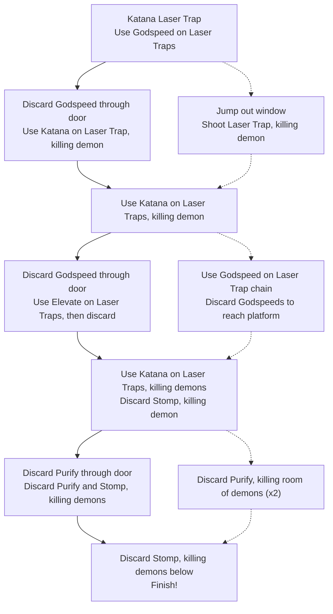

<figure class="align-center">
  
</figure>

|**Release Date:**|16 Jun 2022 <em>(PC)</em>|
|**Developer:**|Angel Matrix|
|**Publisher:**|Annapurna Interactive|
{: .notice--info}

## Overview
That's not a typo in the title. While the baseline routes through each of *Neon
White*'s ninety-seven levels are challenging and zippy, they are designed to be
both carefully explored and naturally discovered, with multiple speedrunning
optimizations baked into every level.

Let's dive into one of them to highlight the choreographed nature of the game's
design. We'll be looking at *Covenant: Hanging Gardens*, the first level of the
sixth mission. But first, here's a quick explanation of the game for the
uninitiated:

### *Neon White* Brief
As a demon slayer in Heaven, you must complete each level by killing every demon
and making it to the Finish. The player can pick up weapon cards to shoot at
demons, though they can also discard those weapons for powerful movement
abilities.

<figure class="align-left">
  
</figure>

The movement abilities -- which are also used to vanquish enemies -- lead to an
exciting, fluid, parkour-like experience. This is further **demon**strated by
the fact that some of them are deliberately designed to be jumped on, such as
the Balloon Demon *(pictured here)*.

While there are, sadly, no balloon demons in this level, it does contain the
following cards, for reference:

|Card|Weapon|Effect|
|---|---|---|
|`Elevate`|Pistol|Double jump|
|`Purify`|Machine Gun|Launch an explosive bomb|
|`Godspeed`|Rifle|Dash forward, destroying enemies|
|`Slam`|Uzi|Slam down, releasing a shockwave|

In addition, many of the demons are "infused" with a particular card, so they'll
always drop them when slain. Demons have characteristics based on their card,
but for the purposes of this walkthrough, we need only understand which card
they drop.

### An Extra Dimension of Speed
It's important to call out that while the levels are each *designed* for speed,
with players finding the fastest combination of firing and discarding their
weapon cards, there's no maximum time for any level. It's possible to complete
most levels at your own pace (including this one).

There's not a ton to explore with this dimension of playing through the game,
but it makes the game much more approachable, regardless of whether someone is a
speedrunner. And while we will see how different routes are baked into each
level, we can also appreciate that max times were not set.

Now we can jump into how someone would naturally progress through the level, if
they were tackling the intended route:

## The First Pass
Although each level has shortcuts hiding in many places, there is also an
intentional route that, while slower, is still quite snappy once understanding
when to use the movement abilities. This gives players a chance to learn new
mechanics and the level's themes but still practice more advanced skills or look
for shorter paths.

This will be the default route for the level, which -- along with shortcut
revealed by the game's mystic Hand, *(discussed later)* -- is enough to pull the
coveted Platinum time for the level.

### Introducing the Laser Traps
Immediately out of the gate, first-time players at *Covenant: Hanging Gardens*
are informed of a new mechanic -- Laser Traps -- that they will be learning
about over the course of the level. Fresh eyes will use their `Katana` on it,
quickly learning that the Laser Traps have 1HP and can destroy breakable
objects, like the door you need to move through.

<figure class="align-center">
  
  <figcaption>
    The starting room, which requires the player to trigger a Laser Trap with
    their `Katana` in order to move forward.
  </figcaption>
</figure>

Next, the player turns the corner, picking up a `Godspeed` card and encountering
a new problem: Laser Traps pointing at them! The model design and placement of
the lasers prompts the player to jump the beams, shooting the two traps on the
way over. With the traps taken care of, the player can then continue into the
next room, discarding `Godspeed` to break through a door and continue to the
next section.

In the hallway with the lasers, the player learns another dimension of the new
Laser Traps: it can also instantly kill them! Players can test it out by walking
into the demonic beams instead of hopping over them -- though their appearance
(and that the beam in the first room counts as a demon) -- already invites
players to avoid and destroy them.

The following leisurely walkaround to the door after destroying the traps gives
new players a chance to breathe, processing the mechanic a bit more, while more
experienced speed-runners might already be thinking about how to optimize away
the slow walk.

<figure class="align-center">
  
</figure>

After dashing through the wall with `Godspeed`, we are met with a familiar idea:
a Laser Trap pointing at a destroyable object. By striking it with `Katana`, the
player confirms what they may have already inferred, that the traps can also
kill enemies.

They'll then move onto some waterfall paths (which speed up player movement)
and repeat the process on the `Godspeed` demon. This teaches them another
important concept, since it takes two Laser Traps to kill the heftier `Godspeed`
demon.

<figure class="align-center">
  
</figure>

Moving forward, the player can collect the `Godspeed` card from the now-fallen
demon and use it to dash through a door into a room. There, aligned in a series,
is a Rube Goldberg machine of Laser Traps, ending in the door you need to move
through.

Since the door is on a high platform, you'll need to grab and discard `Elevate`
to reach the top, making sure to shoot the start of the Laser Trap chain.

The framing of the first Laser Trap in this room, similar to the spawn point,
draws the player's eye, which they then follow like a path of dominoes. Despite
it being the first level with a Laser Trap, players can piece together a variety
of mechanics using the building blocks established earlier.

<figure class="align-center">
  
</figure>

These ideas are then expanded further in later levels. For example, in
*Covenant: Race*, the player must run faster than a huge string of Laser Traps
to reach the end before being cut-off by the traps. Or how some of Neon Yellow's
signature levels -- where the player is unable to use the cards' movement
abilities -- use the Laser Traps as gates to different sections.

### Giving the Player a View
Following the `Elevate` room is a straightforward waterfall path with two
enemies, pointed at again by the Laser Traps. Weaponless, the player must use
their `Katana` to destroy the traps and slay the two demons, with the second one
providing a `Slam` card.

The `Slam` is then immediately discarded, killing another `Slam` demon below and
continuing on a waterfall path, picking up two `Purify` cards along the way.
Here is where the player arrives at a vista with the final section of the level
before them -- a perfect place to contemplate route improvements.

<figure class="align-center">
  
</figure>

After receiving a Gold Medal on a level in *Neon White*, the game will reward
you with a hint shaped like a hand, hidden somewhere in the level. Once touching
the Hand, it will trace a path showing you a faster way to travel. The
difficulty, though, can often be figuring out *how* to move that way while still
taking care of the other demons.

We can see that this hint is placed where the player has full vision of the rest
of the level. It prompts the player to jump down directly to the goal, skipping
the next section, but doesn't explain how they can skip it. The player must
think -- from their well-placed vantage point -- about their next move.

The Hand inspires players to start thinking intricately about what parts of the
level they can zoom through by providing guidance, but not completely
demonstrating how they can skip the last section. But to round things out,
let's walkthrough the final, skippable section, for completion's sake.

### Finishing out the Level
As seen from the vista, the first `Purify` is used to break down the door. The
player must avoid some lasers on their way into the structure, similar to the
first section of the level. This time, however, they're attached in a chain,
too.

<figure class="align-center">
  
</figure>

Next, the second `Purify` is discarded to destroy the demons, door, and start of
the Laser Trap chain at the end of the hallway. The player then collects a
`Stomp` from one of the demolished demons, quickly discarding it to crush
another demon, door, and laser chain group.

<figure class="align-center">
  
</figure>

Finally, the player collects another `Stomp` from the fallen demons and discards
it to dive below to the Finish, destroying the surrounding nearby demons and
completing the level. There's not a ton to learn in this section, as it was
meant to be optimized out, as evidenced by the Hand.

To sum it up, here is a diagram and corresponding path through the level. You
may need to download this image if you want zoom in. Opening it in another tab
also works.

<figure class="align-center">
  
</figure>

## My Optimized Route
I'll now walk through my theoretical maximum. There are probably further
improvements to be made, including niche mechanics like deflecting bullets with
`Katana`, but this will cover what I believe are the intentionally designed
improvements.

Throughout the game, many of these discovered optimizations are, in reality,
baked into the level and hidden for the player to explore within their
attempts. This keeps levels exciting and encourages the player to find shortcuts
of their own. Let's see what I found:

### Through the Looking Glass
The first key route improvement is made once the player realizes that the
foliage-covered windows near the first `Godspeed` are actually open for you to
jump out of. This enables you to shoot the two Laser Traps you otherwise would
have dodged, then hop out the window onto some well-placed water paths.

One problem remains, though: the Laser Trap and demon below. Luckily, since the
player didn't use `Godspeed` on a door, they can deal with the trap from a
distance with a well-placed shot.

<figure class="align-center">
  
  <figcaption>
    A view from just beyond the windows. The Laser Trap and demon are visible
    for the last shot before moving onto dealing with the Godspeed demon.
  </figcaption>
</figure>

Note that each `Godspeed` card has four bullets, so the player is challenged to
shoot each of the three Laser Traps with accuracy, since they'll need `Godspeed`
to cross a gap later in the route. The first section has been crafted to enable
the player to smuggle out a `Godspeed` card but also with speed.

### Bypassing the `Elevate` Room
They'll then swap back to `Katana` to destroy the Laser Traps and killing the
`Godspeed` demon, just like in the other path. With a second `Godspeed`, in
hand, we have the ability to dash twice, jumping over the gap and skipping the
next room -- but just like with the first shortcut, we have to figure out how to
destroy the demons we're avoiding.

In this case, we can consider the fact that the `Elevate` room only had a Laser
Trap chain. As a result, we can clear the room with just a single shot through
the window. Again, the player is given the choice to discover how they may
optimize the route, but many of these are built into the level's design.

<figure class="align-center">
  
  <figcaption>
    With two Godspeeds in hand, the player can dash over the gap to their
    right. But first, they'll need to target the Laser Trap chain inside.
  </figcaption>
</figure>

We then continue on the same waterfall path -- killing a few demons -- until we
end up at the intersection with the game's mystical Hand, hinting us towards a
shortcut.

<figure class="align-center">
  
</figure>

### Clearing Your Heads
This is the game-hinted optimization, noted by the Hand in the diagram and
screenshot.  In good form, the hint shows you *where* to go but not how to get
there. In this case, touching the hint shows the player they can immediately
drop onto the goal to complete the level.

Examining the two `Purify`s in our hand, it's a relatively quick jump to think
of discarding `Purify` to destroy clusters of enemies, rather than to break down
doors. With the windows into each room, the player can fire each `Purify` to
deal with a group of a Head demon, `Stomp` demon, and Laser Trap chain.

Then, using the remaining `Stomp`, it's a quick rush to the end, with the
shockwave cleaning up the last demons at the end of the level very nicely.
Here's a final diagram of the path:

<figure class="align-center">
  
</figure>

The layout of the level further cements the idea that specific sections are
unable to be cut out (like most of the waterfall path sections) while other
parts of the level, with their clustered demons or Laser Trap chains, are
designed to be dealt with quickly.

## Final Analysis
Hopefully, from this walkthrough of a single level, it's apparent the careful
craft that was put into the feel of *Neon White*'s exploration and optimization.

Each mission feels fast and fun from start to finish, yet after taking a closer
look at each level, players will be rewarded with hidden paths and alternate
ways to deal with the same challenges.

### Decision Tree
Here is an (albeit too detailed) decision tree of the path through the level.
There are likely other options missing, but it is enough to illustrate my
point that many optimizations are sectioned off. So, when playing each level,
these "Aha!" moments happens in different places and a different order based on
what's discovered first.

There is already a push towards speedrunning with the game's medal system as
well as Gold/Platinum medal requirements for some story progression. But
designing quicker paths in the level to be discovered by players makes exploring
exiting.

And this is why the game is so much fun. It's feels amazing to rush through
levels quickly with the weapon cards' playful movement abities (especially with
the clubby soundtrack by Machine Girl), but then, players will be encouraged by
the built-in shortcuts they find to each level and be inspired to find shortcuts
of their own!

### Conclusion
*Neon White* makes for an excellent speedrunner -- especially to those new to
the scene -- by adopting the concepts of optimization and exploration. The
levels are designed to be mastered many times over, as players discover new,
shorter routes.

Exceptional amounts of these shortcuts are carefully placed into each level, as
we saw in *Covenant: Hanging Gardens*. Demons are often clustered together or
made to be dealt with in an entirely different way than the "standard" route.

The continuous cycle of exploration and optimization makes it so players can't
help but want to try and improve their time. There's always something new to
explore in each level as you perfect your theoretical best path.
