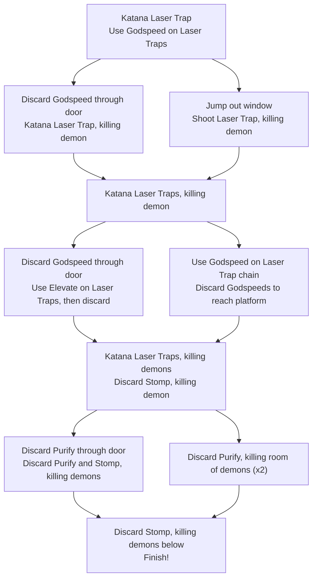

|**Release Date:**| |
|**Developer:**| |
|**Publisher:**| |
{: .notice--info}

## Overview
That's not a typo in the title. While the baseline routes through each of *Neon
White*'s ninety-seven levels are challenging and zippy, they are designed to be
both carefully explored and naturally discovered, with multiple speedrunning
optimizations baked into every level.

Let's dive into one of them to highlight the choreographed nature of the game's
design. We'll be looking at *Covenant: Hanging Gardens*, the first level of the
sixth mission. But first, here's a quick explanation of the game for the
uninitiated:

### *Neon White* Brief
As a demon slayer in Heaven, you must complete the level by killing every demon
and making it to the Finish. The player can pick up weapon cards to shoot at
demons, though they can also discard those weapons for powerful movement
abilities.

The movement abilities lead to an exciting, fluid, parkour-like experience,
similar to *Mirror's Edge*, for example. This is further **demon**strated by the
fact that some of them are deliberately designed to be jumped on, such as the
balloon demon.

While there are, sadly, no balloon demons in this level, it does contain the
following cards, for reference:

|Card|Weapon|Effect|
|---|---|---|
|`Elevate`|Pistol|Double jump|
|`Purify`|Machine Gun|Launch an explosive bomb|
|`Godspeed`|Rifle|Dash forward, destroying enemies|
|`Slam`|Uzi|Slam down, releasing a shockwave|

### An Extra Dimension of Speed
It's important to call out that while the levels are each *designed* for speed,
with players finding the fastest combination of firing and discarding their
weapon cards, there's no maximum time for any level. It's possible to complete
most levels at your own pace (including this one).

There's not a ton to explore with this dimension of speedrunning the game, but
it makes the game much more approachable, regardless of whether someone is a
speedrunner. And while we will see how different routes are baked into each
level, we can also appreciate that max times were not set.

Now we can jump into how someone would naturally progress through the level, if
they were speedrunning the intended route:

## The First Pass

<figure class="align-center">
  
</figure>

Immediately out of the gate, first-time players at *Covenant: Hanging Gardens*
are informed of a new mechanic -- Laser Traps -- that they will be learning
about over the course of the level. Fresh eyes will use their `Katana` on it,
quickly learning that the Laser Traps have 1HP and can destroy breakable
objects, like the door you need to move through.

<figure class="align-center">
  
  <figcaption>
    The starting room, which requires the player to trigger a Laser Trap with
    their `Katana` in order to move forward.
  </figcaption>
</figure>

Next, the player turns the corner, picking up a `Godspeed` card and encountering
a new problem: Laser Traps pointing at them! The model design and placement of
the lasers will prompt the player to jump the beams, shooting the two traps on
the way over. With the traps out of the way, the player can then continue into
the next room, discarding `Godspeed` to break through a door and continue to the
next section.

In this latest section, the player learns another dimension of the new Laser
Trap mechanic: it can also kill them! The leisurely walkaround to the door after
destroying the traps gives new players a chance to process the new mechanic a
bit more, while more experienced speed-runners might already be thinking about
how to optimize away the slow walk.

<figure class="align-center">
  
</figure>

After dashing through the wall with `Godspeed`, we are met with a familiar idea:
a Laser Trap pointing at a destoyable object. By striking it with `Katana`, the
player confirms what they already inferred, that the traps can also kill
enemies.

They'll then move onto some waterfall paths (which speeds up player movement)
and repeat the process on the `Godspeed` demon. This teaches them another
important concept, since it takes two Laser Traps to kill the heftier `Godspeed`
demon.

<figure class="align-center">
  
</figure>

Moving forward, the player can collect the `Godspeed` card from the now-fallen
demon and use it to dash through a door into a room. There, aligned in a series,
is a Rube Goldberg machine of Laser Traps, ending in the door you need to move
through.

Since the door is on a high platform, you'll need to grab and discard `Elevate`
to reach the top, making sure to shoot the start of the Laser Trap chain. While
still the first level that players have encountered a Laser Trap, they are still
able to piece together a variety of mechanics using small building blocks of
knowledge.

<figure class="align-center">
  
</figure>

These mechanics are then expanded further in later levels. For example, in
*Covenant: Race*, the player must run faster than a huge string of Laser Traps
to reach the end before being cut-off by the traps.

1. `Katana` kills Laser Trap, killing Demon
1. `Katana` kills Laser Trap, killing `Stomp` Demon
1. Discard `Stomp`, killing `Stomp` Demon
1. Collect 2 `Purify`s

<figure class="align-center">
  
</figure>

1. Discard `Purify`, destroying Door
1. Discard `Purify`, killing Head Demon, `Stomp` Demon, and Laser Trap chain,
   destoying door.

<figure class="align-center">
  
</figure>

1. Discard `Stomp`, killing Head Demon, `Stomp` Demon, and Laser Trap chain
1. Run off platform and discard `Stomp`, destroying all demons below and
   reaching the Finish

<figure class="align-center">
  
</figure>

## My Optimized Route

<figure class="align-center">
  
</figure>

1. `Katana` kills Laser Trap, destroying Door
1. Collect `Godspeed`

### Through the Looking Glass
1. `Godspeed` kills both Laser Traps

Note that each `Godspeed` card has four bullets, so the player is challenged to
shoot each of the three Laser Traps with accuracy, since they'll need `Godspeed`
to cross the gap, later.

1. Jump out window, `Godspeed` kills Laser Trap, killing Demon

<figure class="align-center">
  
</figure>

1. `Katana` kill Laser Traps on Water platforms, killing `Godspeed` Demon

### Bypassing the `Elevate` Room

1. Collect `Godspeed` and kill Laser Trap chain

<figure class="align-center">
  
</figure>

1. Discard `Godspeed` to bypass `Elevate` room
1. `Katana` kills Laser Trap, killing Demon
1. `Katana` kills Laser Trap, killing `Stomp` Demon
1. Discard `Stomp`, killing `Stomp` Demon

### Clearing Your Heads
This is the game-hinted optimization, noted by the Hand in the diagram as well.
In good form, the hint shows you *where* to go but not how to get there. In this
case, touching the hint shows the player they can immediately drop onto the goal
to complete the level.

1. Collect 2 `Purify`s

<figure class="align-center">
  
</figure>

1. Discard both `Purify`s, killing Head Demons, `Stomp` Demons, and Laser Trap
   chains.
1. Run off platform and discard `Stomp`, destroying all demons below and
   reaching the Finish

### Decision Tree

