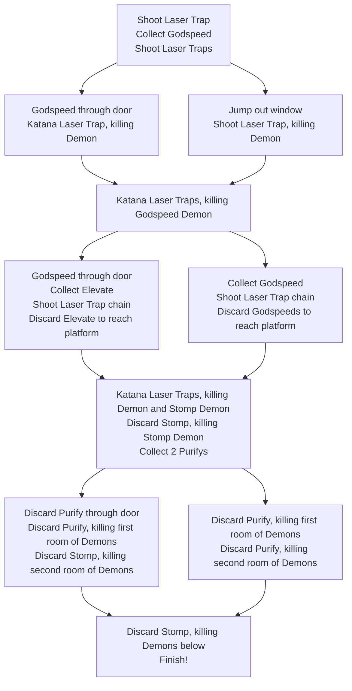

---
title:
excerpt:
last_modified_at:
categories:
 - Video Games
tags:
  - story
  - simulation
  - philosophy
image_directory: "/assets/img/neon-white/"
---

|**Release Date:**| |
|**Developer:**| |
|**Publisher:**| |
{: .notice--info}

## Overview
Neon White's levels are designed to be explored and discovered, even though the
default routes are still challenging and zippy. I wanted to take a deep dive
into one of the levels to highlight where Neon White's level design shines.

We'll be looking at *Covenant: Hanging Gardens*, the first level of the sixth
mission.

## Neon White Brief
To quickly give some context on the game itself:
- FPS focused on speedrunning
- Levels are short, must kill all Demons and reach the finish line
- Weapons can be discarded for movement abilities

## The First Pass

<figure class="align-center">
  
</figure>

1. `Katana` kills Laser Trap, destroying Door

Immediately, first-time player are informed of new mechanic they will be
learning about for over the course of the level. at first, we see that they 1HP
and can destroy breakable objects.

<figure class="align-center">
  
</figure>

1. Collect `Godspeed`
1. `Godspeed` kills both Laser Traps
1. Discard `Godspeed` through Door

<figure class="align-center">
  
</figure>

1. `Katana` kills Laser Trap, killing Demon
1. `Katana` kill Laser Traps on Water platforms, killing `Godspeed` Demon

<figure class="align-center">
  
</figure>

1. Collect and discard `Godspeed` through Door, collecting `Elevate`
1. Shoot Laser Trap chain, destroying Door
1. Discard `Elevate` to reach destroyed Door

<figure class="align-center">
  
</figure>

1. `Katana` kills Laser Trap, killing Demon
1. `Katana` kills Laser Trap, killing `Stomp` Demon
1. Discard `Stomp`, killing `Stomp` Demon
1. Collect 2 `Purify`s

<figure class="align-center">
  
</figure>

1. Discard `Purify`, destroying Door
1. Discard `Purify`, killing Head Demon, `Stomp` Demon, and Laser Trap chain,
   destoying door.

<figure class="align-center">
  
</figure>

1. Discard `Stomp`, killing Head Demon, `Stomp` Demon, and Laser Trap chain
1. Run off platform and discard `Stomp`, destroying all demons below and
   reaching the Finish

<figure class="align-center">
  
</figure>

## My Optimized Route

<figure class="align-center">
  
</figure>

1. `Katana` kills Laser Trap, destroying Door
1. Collect `Godspeed`

### Through the Looking Glass
1. `Godspeed` kills both Laser Traps

Note that each `Godspeed` card has four bullets, so the player is challenged to
shoot each of the three Laser Traps with accuracy, since they'll need `Godspeed`
to cross the gap, later.

1. Jump out window, `Godspeed` kills Laser Trap, killing Demon

<figure class="align-center">
  
</figure>

1. `Katana` kill Laser Traps on Water platforms, killing `Godspeed` Demon

### Bypassing the `Elevate` Room

1. Collect `Godspeed` and kill Laser Trap chain

<figure class="align-center">
  
</figure>

1. Discard `Godspeed` to bypass `Elevate` room
1. `Katana` kills Laser Trap, killing Demon
1. `Katana` kills Laser Trap, killing `Stomp` Demon
1. Discard `Stomp`, killing `Stomp` Demon

### Clearing Your Heads
This is the game-hinted optimization, noted by the Hand in the diagram as well.
In good form, the hint shows you *where* to go but not how to get there. In this
case, touching the hint shows the player they can immediately drop onto the goal
to complete the level.

1. Collect 2 `Purify`s

<figure class="align-center">
  
</figure>

1. Discard both `Purify`s, killing Head Demons, `Stomp` Demons, and Laser Trap
   chains.
1. Run off platform and discard `Stomp`, destroying all demons below and
   reaching the Finish

### Decision Tree

